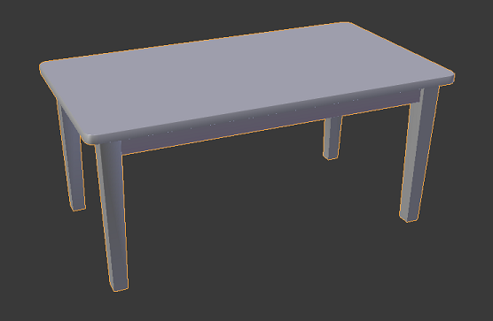

# ProductVisualization

## Membri del gruppo

Cussigh Filippo - n° 123413

Forgiarini Alessandro - n° 120562

## Descrizione del progetto

Il progetto riguarda la creazione di un web visualizer per la visualizzazione e modifica di un modello a scelta.
Il modello scelto è un tavolo suddiviso in due parti: il piano e le gambe.
L'applicazione permette di variare le parti in base al tipo di materiale (legno, plastica, metallo, marmo), a una selezione di colori scelti adatti ai materiali, e ad un fattore di roughness che determina la ruvidità/imperfezione della superficie.
La telecamera è interamente manovrabile e consente la libera ispezione del tavolo.
Il progetto è inoltre realizzato in modo da mantenere le medesime funzionalità anche su mobile.

## Modelli e Texture

Il modello del tavolo è scaricato dal sito www.cgtrader.com con royalty free license ed è stato modificato e UV-mapped per adattarsi alle esigenze.
Le texture sono disegnate a partire da basi reperite su www.textures.com, ricomposte e ritoccate per costruire la diffuseMap da cui poi sono state realizzate le altre texture necessarie. Le normalMap in particolare sono generate tramite plugin di Gimp esterno a partire dalle diffuseMap.

## Shader

Gli shader creati implementano la Lambertian BRDF e la Microfacet Specular BRDF per il calcolo rispettivamente del fattore diffuse e specular.
In particolare per la Microfacet Specular BRDF vengono utilizzate:
- la funzione di Schlick per la riflettanza di Fresnel
- la GGX per la distrubuzione delle microfaccette
- l'approssimazione di Smith per il fattore geometrico

Inoltre viene implementato il bump mapping.

Gli shader utilizzano quattro texture per ciascune materiale: Diffuse map, Roughness map, Specular map e Normal map

Le luci utilizzate sono bianche e puntiformi, che illuminano la quasi totalità dell'oggetto, in quanto deve risultare visibile da tutte le angolazioni per via dello spostamento manuale della telecamera.

## Interfaccia

L'interfaccia è stata scritta manualmente per permettere la creazione di un menù dinamico, che varii le opzioni a disposizione in base alla scelta del materiale.
Il menù è diviso in due sezioni indipendenti per la modifica delle due parti del modello tramite un menù a tendina per il materiale, una selezione a icone per il colore e uno slider per la roughness.
Il css dei menù è interamente personalizzato in tutti i suoi elementi grafici.
Sono state implementate le animazioni per l'apertura e chiusura dei menù e del pulsante di collapse.
Il menù inoltre implementa una scrollbar nell'eventualità il browser venga ridimensionato e non siano visibili tutti i comandi, oppure nel caso sia visualizzato da mobile e la grandezza dello schermo non sia sufficiente.

## Testing
Il visualizzatore mantiene i 60fps su desktop.
Su mobile è stato testato sia su chrome che su safari e preserva la totalità delle funzionalità.
Sui dispositivi di fascia medio-alta (iphone 6, iphone SE, OnePlus3) il framerate rimane inalterato a 60fps.
Sui dispositivi di fascia bassa (Asus zenphone 2, Xiaomi mi a1, Huawei P8 lite smart) il framerate varia dai 30 ai 45 frame.
