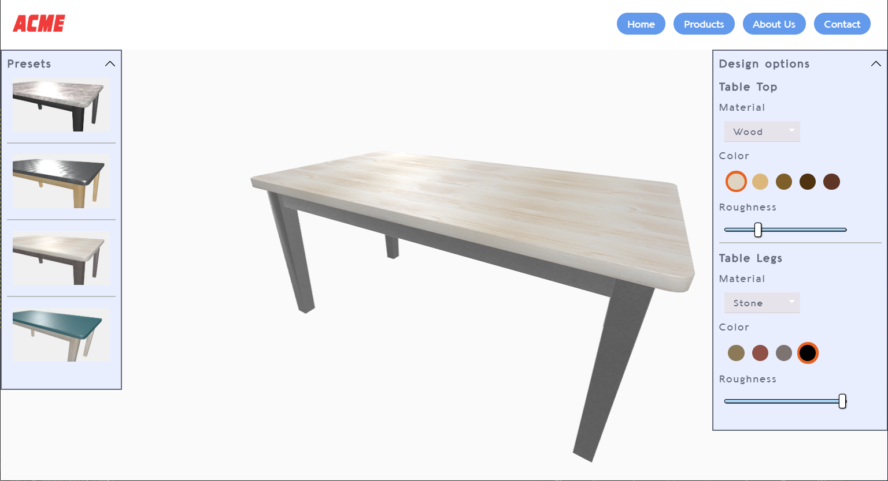

# ProductVisualization

## Membri del gruppo

Cussigh Filippo - n° 123413

Forgiarini Alessandro - n° 120562

## Descrizione del progetto

Il progetto riguarda la creazione di un web visualizer per la visualizzazione e modifica di un modello a scelta.
Il modello scelto &egrave; un tavolo suddiviso in due parti: il piano e le gambe.
L&apos;applicazione permette di variare le parti in base al tipo di materiale (legno, plastica, pietra, marmo, alluminio), a una selezione di colori scelti adatti ai materiali, e ad un fattore di roughness che determina la ruvidit&agrave;/il rilievo della superficie.
La telecamera &egrave; interamente manovrabile e consente la libera ispezione del tavolo.
Il progetto &egrave; stato pensato per mantenere le stesse funzionalit&agrave; sui dispositivi mobile.

## Modelli e Texture

Il modello del tavolo &egrave; scaricato dal sito [CG Trader](https://www.cgtrader.com) con royalty free license ed &egrave; stato modificato e UV-mapped per adattarsi alle esigenze.
Le texture sono disegnate a partire da basi reperite su [textures.com](https://www.textures.com), ricomposte e ritoccate per costruire la diffuseMap da cui poi sono state realizzate le altre texture necessarie. Le normalMap in particolare sono generate tramite plugin di Gimp esterno a partire dalle diffuseMap.

## Shader

Gli shader creati implementano la Lambertian BRDF e la Microfacet Specular BRDF per il calcolo rispettivamente del fattore diffuse e specular.
In particolare per la Microfacet Specular BRDF vengono utilizzate:
- la funzione di Schlick per la riflettanza di Fresnel
- la GGX per la distrubuzione delle microfaccette
- l&apos;approssimazione di Smith per il fattore geometrico

Inoltre viene implementato il bump mapping.

Gli shader utilizzano quattro texture per ciascune materiale: Diffuse map, Roughness map, Specular map e Normal map

Le luci utilizzate sono bianche e puntiformi, che illuminano la quasi totalit&agrave; dell&apos;oggetto, in quanto deve risultare visibile da tutte le angolazioni per via dello spostamento manuale della telecamera.
Infine &egrave; presente una luce ambientale di intensit&agrave; bassa per rendere visibili le parti del tavolo non raggiunte dalle luci puntiformi.

## Interfaccia

### Men&ugrave; di design

L&apos;interfaccia &egrave; stata progettata da zero per permettere la creazione di un men&ugrave; dinamico, che varii le opzioni a disposizione in base alla scelta del materiale.
Essa &egrave; divisa in due sezioni indipendenti per la modifica delle parti del modello tramite un men&ugrave; a tendina per il materiale, una selezione a icone per il colore e uno slider per la ruvidit&agrave;/il rilievo della superficie.
Il css dei men&ugrave; &egrave; interamente personalizzato in tutti i suoi elementi grafici.
Sono state implementate le animazioni per l&apos;apertura e chiusura dei men&ugrave; e del pulsante di collapse.
Il men&ugrave; inoltre implementa una scrollbar nell&apos;eventualit&agrave; il browser venga ridimensionato e non siano visibili tutti i comandi, oppure nel caso sia visualizzato da mobile e la grandezza dello schermo non sia sufficiente.
Nello screenshot si pu&ograve; vedere la casistica del men&ugrave; chiuso e del men&ugrave; scorrevole tramite barra. 

### Men&ugrave; dei preset

A partire dall&apos;interfiaccia gi&agrave; realizzata, &egrave; stato creato un men&ugrave; per la selezione di preset predeterminati, che consentono di scegliere dei tavoli gi&agrave; abbinati nelle loro parti. La selezione del preset cambia i valori del men&ugrave; di design, permettendo poi all&apos;utente di modificare il tavolo a partire da quei valori.

## Testing
Il visualizzatore mantiene i 60fps su desktop.
Su tablet preserva la totalit&agrave; delle funzionalit&agrave; e del framerate.
Data la natura dei men&ugrave;, che necessitano di una certa risoluzione in larghezza, per preservare la funzionalit&agrave; su smartphone viene nascosto automaticamente il men&ugrave; dei preset e l&apos;intestazione del sito.
Il visualizzatore &egrave; stato testato su diversi dispositivi per controllare il framerate:
Sui dispositivi di fascia medio-alta (iphone 6, iphone SE, OnePlus3) il framerate rimane inalterato a 60fps.
Sui dispositivi di fascia bassa (Asus zenphone 2, Xiaomi mi a1, Huawei P8 lite smart) il framerate varia dai 30 ai 45 frame.
